# About this repository

This is a repository to store a code and concepts of free youtube course 'Jornada Devops de Elite' that is teachered by Fabricio Veronez (DevOps Pro).

I was used a Ubuntu SO and all of install documentation are about that.

All examples are store in the respective folder and documented in Makefile also.

## Part 1 - Docker and containerization

### 1.0 - Prerequisites to install

- docker: https://docs.docker.com/engine/install/ubuntu/
- make: https://www.gnu.org/software/make/

### 1.1 - Docker Architecture

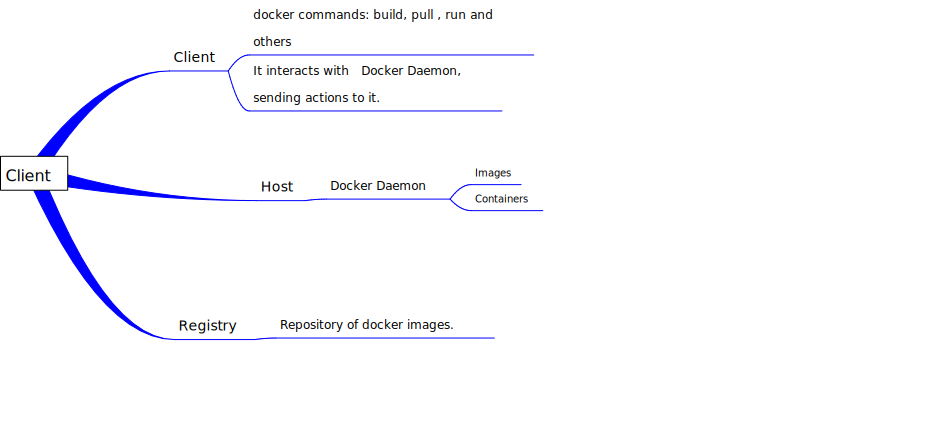

### 1.2 - Docker layers

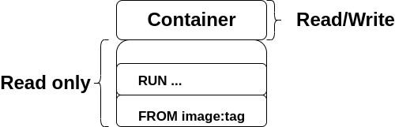

## Part 2 - Kubernets and container orchestration

### 2.0 - Prerequisites to install

- k3d: https://k3d.io/v5.4.6/
    It is a tool to run kubernets cluster locally

- kubect: https://kubernetes.io/docs/tasks/tools/install-kubectl-linux/
    It is a tool to interacts with kubernets cluster

### 2.1 -  k3d cluster

To create a k3d cluster run: 
    k3d cluster create <cluster_name> (optional)
    k3d cluster create --no-lb (optional condition without load balancer)

To create a k3d cluster with server/agents

    k3d create <cluster_name> --servers <number> --agents <number>
    example: k3d cluster create simple-cluster --servers 2 --agents 2

To list cluster:
    k3d cluster list

To delete cluster
    k3d cluster delete

### 2.2 - kubernets resources

**2.2.0 - Pod:**

It is a smallest resource in kubernets and into them is stored containers.

- All containers in same pod share IP and file system.

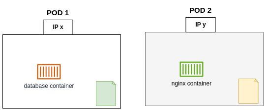

executing pods pointed to localhost:

    kubect port-forward pod/<pod_name> hostPort:podPort

get pods with label filter:

    kubect get pods -l <label_tag>:<label_value>

**2.2.1 - ReplicaSet**

This feature keeps desired number of pods equal to the number of running pods.
But there is no automatic creation of pod with latest configuration, to see the last config applied, you must perform deletion and after a new creation of pod.

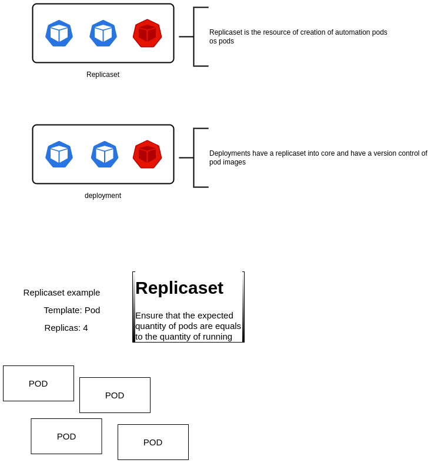

**2.2.3 - Deployment**

**2.2.4 - Services**

Service types:

- Internal communication:
    - ClusterIp

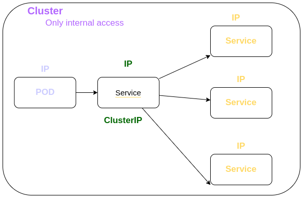

- External communication:

    - NodePort
    - LoadBalancer

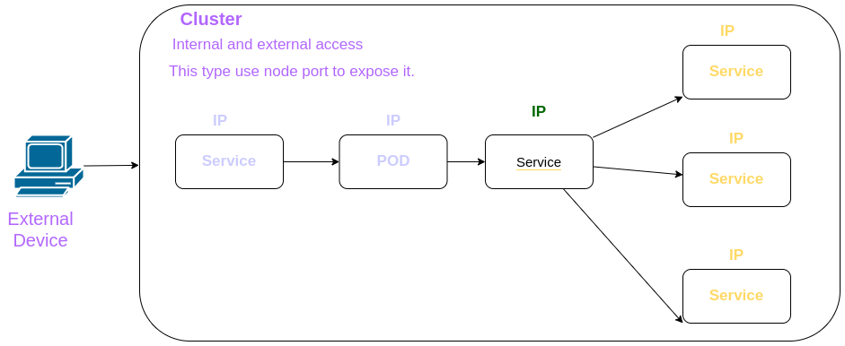

### 2.3 -  kubect general commands

- see default kube config file by path
    cat ~/.kube/config

- list api resource api

    kubect api-resources
    
    with resource filter: kubectl api-resource | grep <resource>

- list resources (nodes,deployments,pods and other)
    kubect get <resource>
    
- describe resource:
    kubect describe <resource> <name>

- apply or create resource by .yml

    kubect apply -f <filename>.yml
    kubect create -f <filename>.yml

## Part 3 - Terrafor and infraestructure as code

### 3.0 - Prerequisites

- Install terraform tool:
    https://www.terraform.io/downloads

### 3.1

Terraform is a tool to apply infraestructure as code (IAC).

In this case, the used provider is Digital Ocean and you need that run this steps bellow:

- To execute terraform setup files
    - Create Digital Ocean Account:  
        https://www.digitalocean.com/
    
    - Generate  ssh key to connect into droplet by ssh key pair
        ssh-keygen -t rsa -b 2048 

### 3.2 -  Features and resources

**3.2.0 - Resource**

Refere-se a um recurso a ser criado ou atualizado no momento do apply

**3.2.1 - Data Source**

It refers to previously created resource inside provider.

**3.2.2 - Providers**

It Refers to cloud service as AWS, GCP, Digital Ocean, Azure and anothers.

**3.2.3 Terraform settings**

**3.2.4 Variables**

As well as in programing, we can reference variables with this feature.

**3.2.5 Outputs**

After running the terraform configuration flow, we can save, through the present resource, the outputs of some other resource.

## Part 4 - Jenkins and CI/CD

### 4.0 - Prerequisites

### 4.1 - Continous integration (CI)

Continous integration is a flow that contains these steps:

- codification
- commit
- building
- test
- packaging

### 4.2 - Continous Deploy

Continous deploy is a flow that contains these steps:

- release 
- acceptance tests
- deploy 

## Part 5 - Observability with Grafana and Prometheus

### 5.0 - Prerequisites

### 5.1 - Metrics

Métricas são medições numéricas relativas a dados de um software, sendo disponibilizadas em uma linha temporal.

**5.1.0 - Types os metrics**

System Metrics

- Request amount
- Quantity of Errors
- Resource consumption
- Resource timing access

Businnes Metrics

- User type of application access
- Product by

**5.1.1 - Metrics are not Logs**

Metrics are different from logs, as they have data organized and exposed through some interface, which can be numerical data, graphs or aggregations of values.

Logs are textual data, error messages.

### 5.2 - Prometheus

Documentation: https://prometheus.io

It is an open source tool for managing and monitoring software metrics. It has several ways to visualize data.

Prometheus is a standalone tool and has been graduated by the CNFC (Cloud Native Computing Foundation), so it doesn't need additional software to run.

**5.2.0 - Prometheus Server**

The Prometheus server is responsible for managing and maintaining three parts, and they are:

- Retrieval : Responsible for the management and execution of jobs

- Storage: Responsible for storing data in TSDB format.

- PromQL: Responsible for searches within the data.

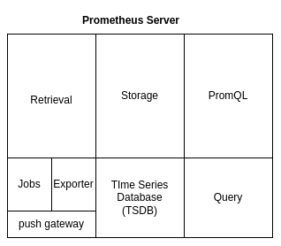

**5.2.0 - Time series database (TSDB)**

There are, in general, two ways of storing data:

- Pure: Prometheus itself stores data in sets every two hours.

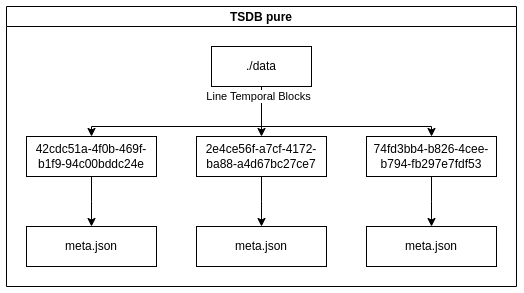

- With an Adapter: An external service is used to perform this storage.

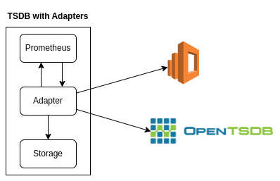

**5.2.1 - Retrieval and jobs**

This resource is responsible for performing data collection.

Data collection is done through endpoints that are exposed in the application, prometheus accesses this endpoint and thus manages to obtain the data.

Prometheus supports multiple programming languages ​​(Python, Java and others) and tools (Docker, Kubernets, Grafana and others).

But, when it does not have integration with such software or platform, we can use Exporters.

**Exporter**

It is a tool that runs inside the application server and collects the metrics for availability via api.

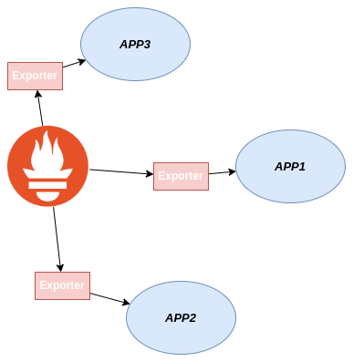

**Push Gateway**

It is a tool that makes data available for short-lived processes, such as tasks and workers.

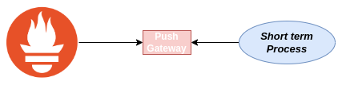

**Service Discorvery**

**5.2.2 - PromQL**

After collecting data, it is necessary to expose them in some way, the means that Prometheus can do this are:

- Web Ui : It's a built-in endpoint (usually used for quick access or testing).

- Grafana

- API: The query can be done via api.

**5.2.3 - Alert Manager**

Going in parallel with the parts mentioned above, we have the Prometheus alerts mechanism that can be addressed to different stacks, such as: Slack, Telegram, Discord and others.

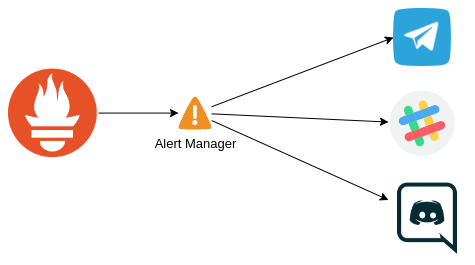

## General Reference

**(Docker)**

- https://www.youtube.com/watch?v=UlbeZ97TWyY&t=197s

- https://docs.docker.com/desktop/

**(Kubernets)**

- https://www.youtube.com/watch?v=4U2Ej_miGeM&t=4s

- https://kubernetes.io/docs/reference/

**(Terraform)**

- https://www.youtube.com/watch?v=2uXNNKLyP34&t=4s

- https://registry.terraform.io/browse/providers

**(Jenkins)**

- https://www.youtube.com/watch?v=vi-CwU4Qgq8

- https://www.jenkins.io