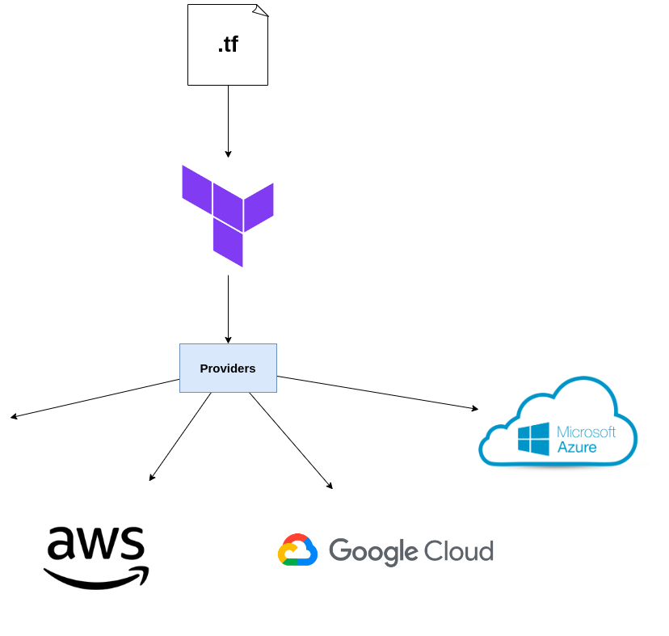

# About this repository

This is a repository to store a code and concepts of free youtube course 'Jornada Devops de Elite' that is teachered by Fabricio Veronez (DevOps Pro).

I was used a Ubuntu SO and all of install documentation are about that.

All examples are store in the respective folder and documented in Makefile also.

## Part 1 - Docker and containerization

### 1.0 - Prerequisites to install

- docker: https://docs.docker.com/engine/install/ubuntu/
- make: https://www.gnu.org/software/make/

### 1.1 - Docker Architecture

### 1.2 - Docker layers

## Part 2 - Kubernets and container orchestration

### 2.0 - Prerequisites to install

- k3d: https://k3d.io/v5.4.6/
    It is a tool to run kubernets cluster locally

- kubect: https://kubernetes.io/docs/tasks/tools/install-kubectl-linux/
    It is a tool to interacts with kubernets cluster

### 2.1 -  k3d cluster

To create a k3d cluster run: 
    k3d cluster create <cluster_name> (optional)
    k3d cluster create --no-lb (optional condition without load balancer)

To create a k3d cluster with server/agents

    k3d create <cluster_name> --servers <number> --agents <number>
    example: k3d cluster create simple-cluster --servers 2 --agents 2

To list cluster:
    k3d cluster list

To delete cluster
    k3d cluster delete

### 2.2 - kubernets resources

**2.2.0 - Pod:**

It is a smallest resource in kubernets and into them is stored containers.

- All containers in same pod share IP and file system.

executing pods pointed to localhost:

    kubect port-forward pod/<pod_name> hostPort:podPort

get pods with label filter:

    kubect get pods -l <label_tag>:<label_value>

**2.2.1 - ReplicaSet**

This feature keeps desired number of pods equal to the number of running pods.
But there is no automatic creation of pod with latest configuration, to see the last config applied, you must perform deletion and after a new creation of pod.

**2.2.3 - Deployment**

**2.2.4 - Services**

Service types:

- Internal communication:
    - ClusterIp

- External communication:

    - NodePort
    - LoadBalancer

### 2.3 -  kubect general commands

- see default kube config file by path
    cat ~/.kube/config

- list api resource api

    kubect api-resources
    
    with resource filter: kubectl api-resource | grep <resource>

- list resources (nodes,deployments,pods and other)
    kubect get <resource>
    
- describe resource:
    kubect describe <resource> <name>

- apply or create resource by .yml

    kubect apply -f <filename>.yml
    kubect create -f <filename>.yml

## Part 3 - Terrafor and infraestructure as code

### 3.0 - Prerequisites to install

- https://www.terraform.io/downloads

### 3.1

Terraform is a tool to apply infraestructure as code (IAC).

### 3.2 -  Features and resources

**3.2.0 - Resource**

**3.2.1 - Data Source**

**3.2.2 - Providers**

## General Reference

(Docker)
- https://www.youtube.com/watch?v=UlbeZ97TWyY&t=197s

(Kubernets)
- https://www.youtube.com/watch?v=4U2Ej_miGeM&t=4s

(Terraform)
- https://www.youtube.com/watch?v=2uXNNKLyP34&t=4s
